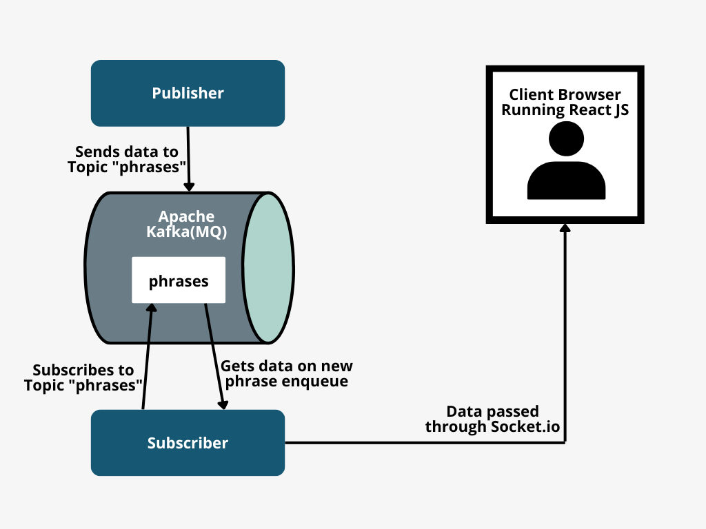

# Basic Pub-Sub in NodeJS with Apache Kafka

## Installation

Prerequisites: Install Docker and Docker compose and start by typing on root folder of the project.

```bash
  docker-compose up -d
```

## General Architecture



## Todo

- Setup for production with bash and pm2
- Add .env files for all the services
- Add file prettier and eslint
- Refactor
